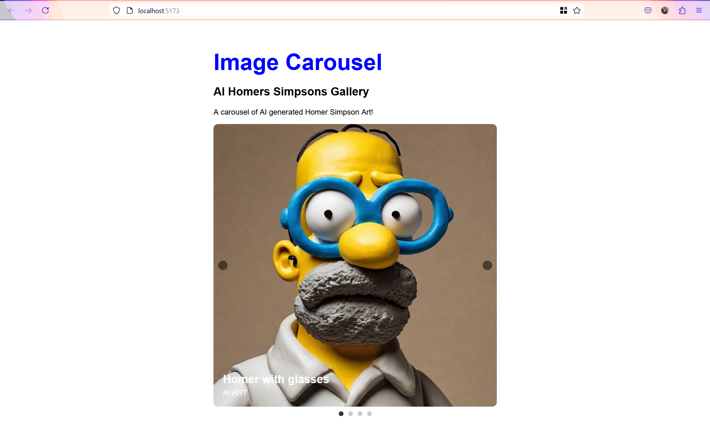

# AI Homers Simpsons Gallery

This project is a simple image carousel showcasing AI-generated artwork of Homer Simpson. It's built with HTML, CSS, and JavaScript.



## Features

- **Image Carousel:** A carousel of AI-generated Homer Simpson art.
- **Descriptive Captions:** Each image includes a descriptive caption.
- **Navigation Controls:** Arrows for navigating between images.
- **Pagination Indicators:** Dots indicating the current image position within the carousel.

## Technologies Used

- **HTML**: For the structure of the application.
- **CSS**: For styling the application.
- **JavaScript**: For adding interactivity and logic.
- **Vite**: For faster development and module bundling.

## Screenshot


## GIF Demo

Include a GIF demo of your application by adding a file and replacing the placeholder `./path-to-your-demo.gif` with the actual path to your GIF.


## Installation

1. Clone the repository:

   ```bash
   git clone https://github.com/suze8589/carousel-images.git
   ```

2. Navigate to the project directory:

   ```bash
   cd carousel-images
   ```

3. Install the dependencies:

   ```bash
   npm install
   ```

4. Run the development server:

   ```bash
   npm run dev
   ```

5. Open your browser and navigate to:
   ```
   http://localhost:5173
   ```

## Project Structure

```
carousel-images/
└── media         # Folder for the images
├── index.html       # Main HTML file
├── styles.css       # CSS file for styling
├── script.js        # JavaScript file for functionality
├── vite.config.js   # Vite configuration file
├── package.json     # Project dependencies and scripts
└── README.md        # Project documentation
```

## How to Use

1. Open the application in your browser.
2. Use the left and right arrows to navigate through the carousel.

## Future Improvements

- Image Loading: Implement a loading indicator while images are being loaded.
- Responsive Design: Ensure the carousel adapts seamlessly to different screen sizes.
- Animations: Enhance the user experience with smooth transitions and animations.
- Dynamic Content: Fetch images from an API to display a larger collection of images.

## License

This project is licensed under the MIT License. See the LICENSE file for more details.

## Acknowledgments

- Built using the Vite framework for rapid development.
- Images and data used in the project are for demonstration purposes only.
